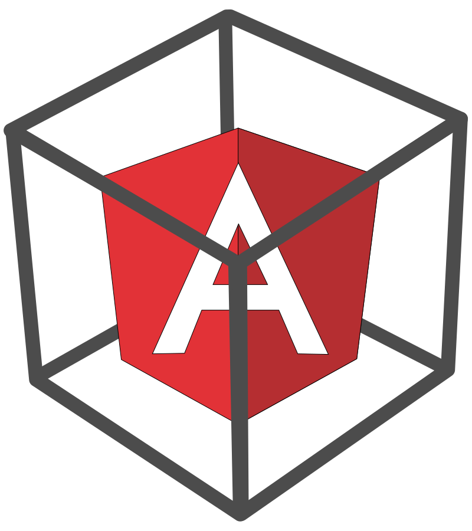

    
     
    
    
    

*Automated client-side template injection (CSTI, sandbox escape) detection for AngularJS!*

## Demo
 

## Installation

Install [Python 3.2](https://www.python.org/downloads/) and the requirements.

`pip install -r requirements.txt`

## Usage

### Options
`python acstis.py [options]`
* `-u <uri>`,      `--uri=<uri>`              (required)        The URI to run the exploit on (e.g. https://www.example.ltd/?vulnerable=param).
* `-v`,            `--verify`                 (optional)        Extra check by a JavaScript engine to ensure the payload is executed.
* `-h`,            `--help`                   (optional)        Print this help message.

### Examples

**Print a help message:**

`python acstis.py --help`

**Check a single URI:**

`python acstis.py --uri="http://example.ltd/some/page?test1=a&test2=b&test3=c"`

**Check a single URI and use a JavaScript engine to ensure the alert really pops:**

`python acstis.py --uri="http://example.ltd/some/page?test1=a&test2=b&test3=c" --verify`

**Crawl the whole website and check all URI's for AngularJS sandbox escape:**

`python acstis.py --uri="http://example.ltd/" --crawl`

**Stop checking all the URI's if a vulnerable was found:**

`python acstis.py --uri="http://example.ltd/" --crawl --quit-if-vulnerable`

## ToDo

1. Use Selenium headless (maybe using PhantomJS).
2. Add support for cookies and basic auth.
3. Add support for SEO url injection.
4. Document all code.
